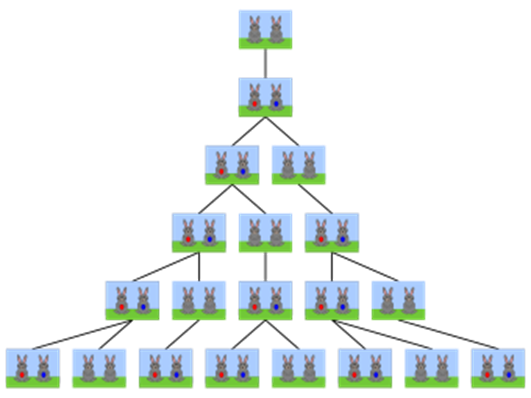

# Sequência de Fibonacci e Proporção Áurea
Na matemática, a sucessão de **Fibonacci** (ou sequência de Fibonacci), é uma sequência de números inteiros, começando normalmente por 0 e 1, na qual cada termo subsequente corresponde à soma dos dois anteriores. A sequência recebeu o nome do matemático italiano Leonardo de Pisa ou Leonardo Fibonacci, mais conhecido por apenas Fibonacci, que descreveu, no ano de 1202, o crescimento de uma população de coelhos, a partir desta. Esta sequência já era, no entanto, conhecida na antiguidade.

Os números de Fibonacci são, portanto, os números que compõem a seguinte sequência:

```
1, 1, 2, 3, 5, 8, 13, 21, 34, 55, 89, 144, 233, 377, 610, 987, 1597, 2584, ...
```

É importante destacar que a sequência de Fibonacci é infinita. Portanto, o ideal é que você defina um valor que tenha como objetivo e, ao alcançar esse objetivo, você decida uma nova meta para alcançar. Em termos matemáticos, a sequência é definida recursivamente pela fórmula abaixo, sendo o primeiro termo `F_1 = 1`:

```
F_n = F_(n-1) + F_(n-2)
```

e valores iniciais `F_1=1` e `F_2=1`.

A sequência de Fibonacci tem aplicações na análise de mercados financeiros, na ciência da computação e na teoria dos jogos. Também aparece em configurações biológicas, como, por exemplo, na disposição dos galhos das árvores ou das folhas em uma haste, no arranjo do cone da alcachofra, do abacaxi, ou no desenrolar da samambaia.

## Origem:
No ocidente, a sequência de Fibonacci apareceu pela primeira vez no livro Liber Abaci (1202) de Leonardo Fibonacci, embora ela já tivesse sido descrita por gregos e indianos. Fibonacci considerou o crescimento de uma população idealizada (não realista biologicamente) de coelhos.


 
Os números descrevem o número de casais na população de coelhos depois de **n** meses se for suposto que:

- no primeiro mês nasce apenas 1 casal;
- casais amadurecem de forma sexual (e reproduzem-se) apenas após o segundo mês de vida;
- não há problemas genéticos no cruzamento consanguíneo;
- todos os meses, cada casal fértil dá a luz a um novo casal; e
- os coelhos nunca morrem.

## A razão áurea:
A razão áurea, frequentemente representada pelo símbolo grego φ (phi), é um número irracional que aparece em várias áreas da matemática, arte, arquitetura, e na natureza. Seu valor é aproximadamente 1.61803398875, mas, por ser irracional, possui uma representação decimal infinita sem uma repetição periódica.

### Passos para calcular a razão áurea a partir da série de Fibonacci:
1. Calcular Termos Consecutivos da Série de Fibonacci: Calcule os termos da sequência de Fibonacci até alcançar uma precisão desejada.
2. Calcular Razões entre Termos Consecutivos: Divida cada termo pelo seu anterior (exceto para os primeiros termos, onde não há termos anteriores).
3. Observar a Convergência das Razões: À medida que você avança na série de Fibonacci, as razões entre termos consecutivos se aproximam da razão áurea.

## O que deve ser feito...
Escreva código-fonte MIPS/MARS contendo:
1. Implementação de função para determinar o n-ésimo termo da Sequência de Fibonacci;
2. Use a função implementada em no item anterior para determinar o 30° número de Fibonacci;
3. Implementação de função para determinar a razão áurea ϕ;
4. Use a função implementada acima para determinar  usando _F_41_ e _F_40_;

No final da execução do código fonte:
1. O valor do 30° termo da Série de Fibonacci deve estar armazenado no registrador $s1;
2. O valor do 41° termo da Série de Fibonacci deve estar em $s2;
3. O valor do 40° termo da Série de Fibonacci deve estar em $s3;
4. O valor da razão áurea ϕ (phi) deve  estar em $f0;

### Observações
1. Deve ser entregue o código MIPS/MARS desenvolvido.
2. Este trabalho prático deve ser realizado em grupos de até 5 alunos.
3. Caso seja entregue com atraso, o valor total passará a ser, para n dias de atraso, 3,0 ∙ 0,9^n.
4. O trabalho deverá ser postado no AVA, em template próprio.
5. Todas as seções do template devem ser preenchidas.
6. Deve ser utilizada a formatação indicada no próprio arquivo template.